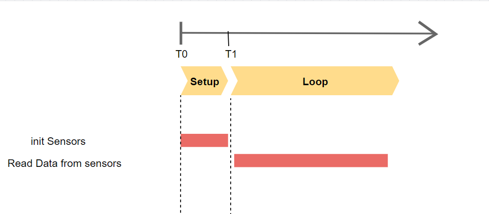
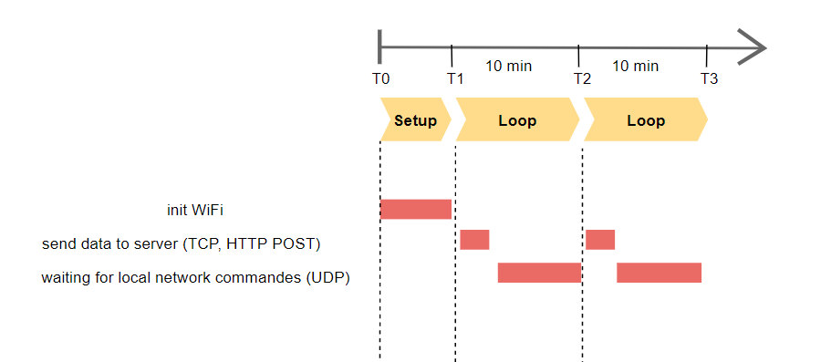
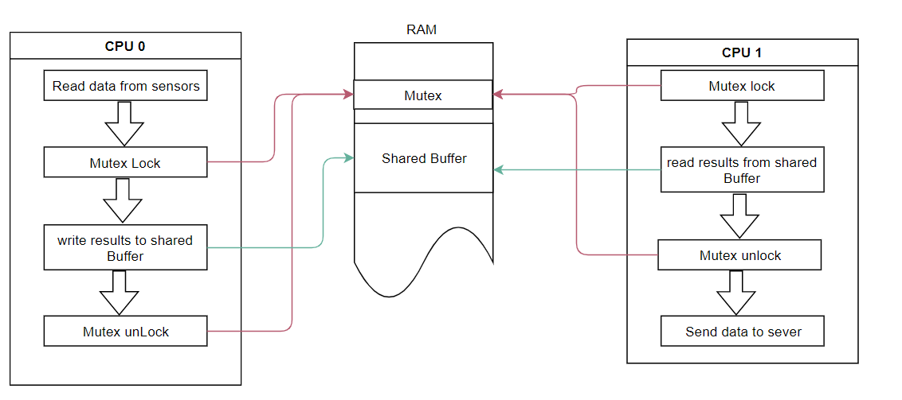
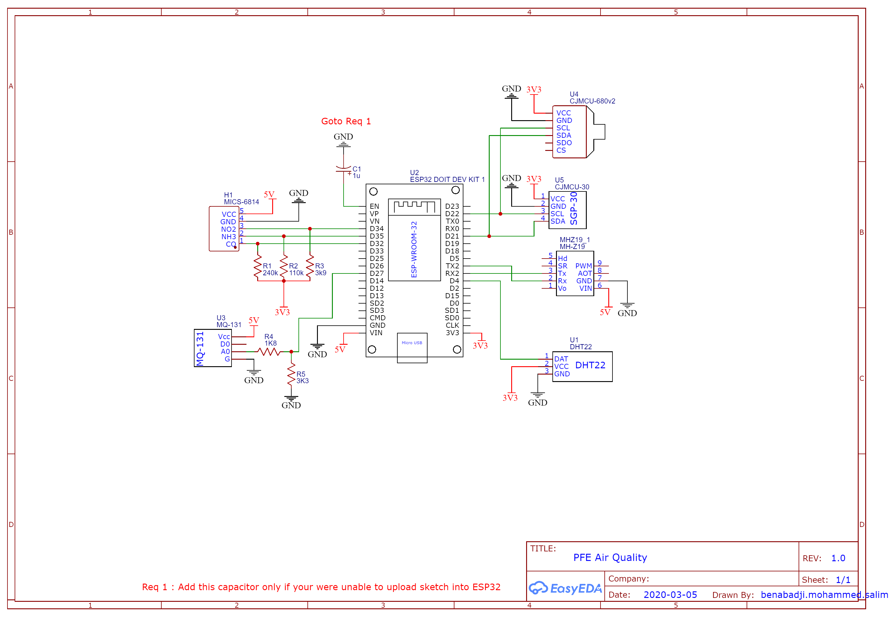

# ESP32

The ESP32 is the ESP8266 successor. It adds an extra CPU core, faster Wi-Fi, more GPIOs, and supports Bluetooth 4.2 and Bluetooth low energy

# Current Status

- Sensors
    + [X] wiring & schema
    + [X] read data from sensor
    + [X] data to JSON format
    + [X] adding polymorphisme to sensor classes in order to regroup them into list object and make code clean & dynamic
    + [X] internal error handler if read data fails
- Network
    + [X] config mode by setting ESP32 as an access point 
    + [X] adding local network commandes using UDP broadcast 
    + [X] send data to firebase periodically
    + [ ] update https certificate
    + [ ] local network TCP engine
- Dual Core ESP32
    + [X] adding mutex (mutual exclusion) 
    + [X] synchronization
- ULP coprocessor
    + [X] read state of core 0 and core 1 from RTC memory
    + [X] for each state play led animation on externals leds

    

    
## ESP32 Core 0
timeline diagram 

## ESP32 Core 1
timeline diagram 

# ESP32 Core Communication
.

# hardware Setup
in this project i'm using DOIT ESP32 DevKit Board with SGP30, BME680, DHT22, MICS6814, MHZ19, MQ131 modules

## Wire

| DHT22 | ESP32 | 
|-------|-------|
| GND   | GND   |
| 3V3   | 3V3   |
| DAT   | D4    |

| MHZ19 | ESP32 | 
|-------|-------|
| GND   | GND   |
| 5V    | VIN   |
| TX    | RX2   |
| RX    | TX2   |

| SGP30 | ESP32 | 
|-------|-------|
| GND   | GND   |
| 3V3   | 3V3   |
| SCL   | D22   |
| SDA   | D21   |

| BME680 | ESP32 | 
|--------|-------|
| GND    | GND   |
| 3V3    | 3V3   |
| SCL    | D22   |
| SDA    | D21   |

| MICS6814 | ESP32 | 
|----------|-------|
| GND      | GND   |
| 5V       | VIN   |
| NO2      | D34   |
| NH3      | D35   |
| CO       | D32   |

| MQ-131 | ESP32 | 
|--------|-------|
| GND    | GND   |
| 5V     | VIN   |
| AO     | D27   |

# Sensors

| Sensor   | Protocol    | Pin Count |
| -------- | ----------- | --------- |
| DHT22    | digital     | 1         |
| SGP30    | I2C         | 2         |
| BME680   | I2C         | 2         |
| MICS6814 | Analog      | 3         |
| MHZ19    | Serial port | 2         |
| MQ131    | Analog      | 1         |

See also: https://easyeda.com/benabadji.mohammed.salim/pfe-air-quality

