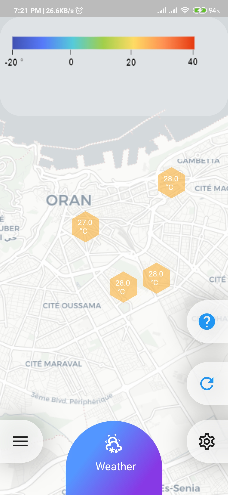
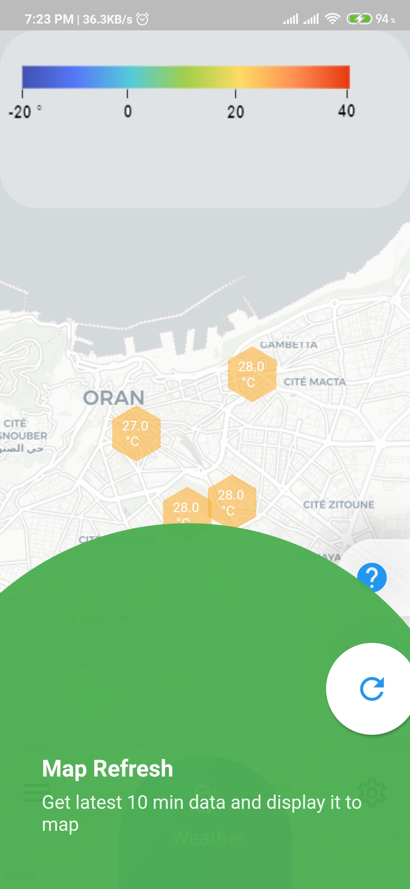
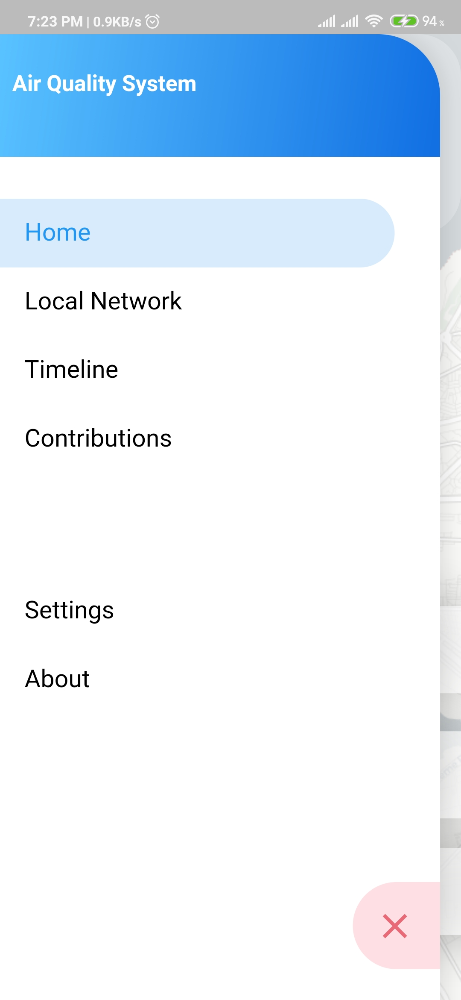
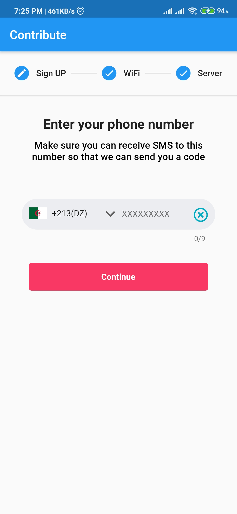
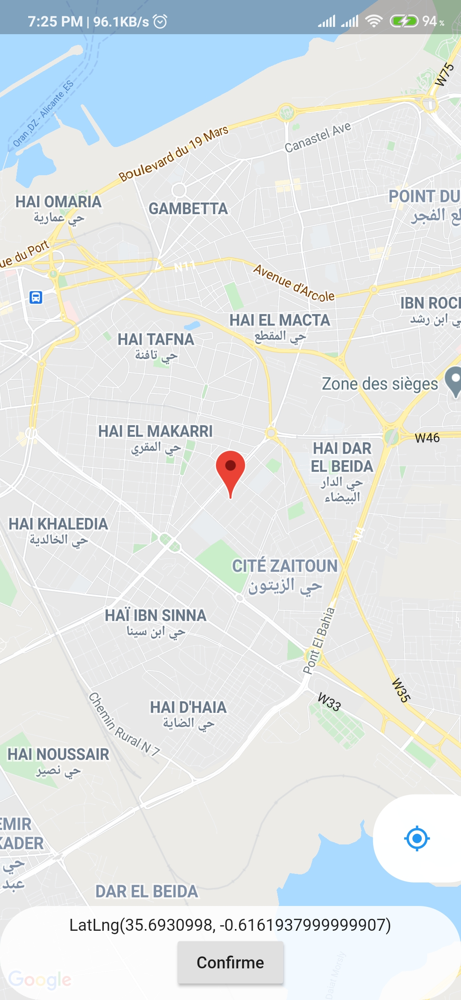
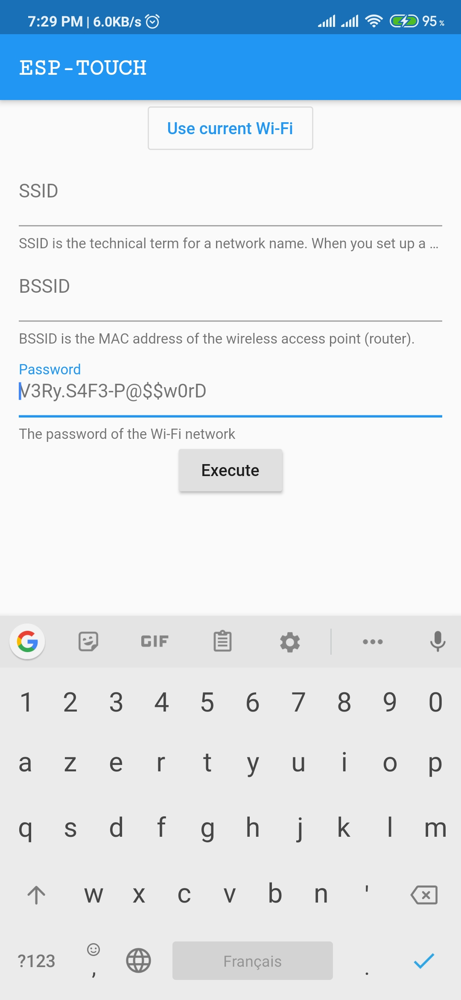
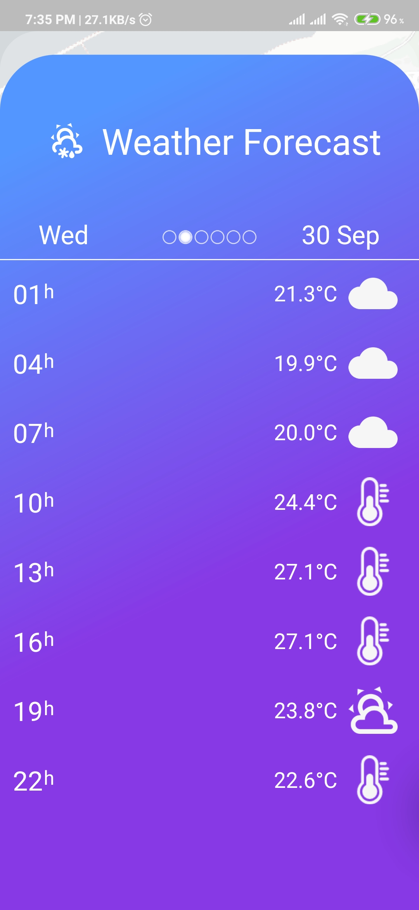
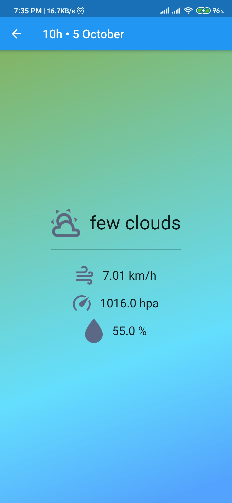
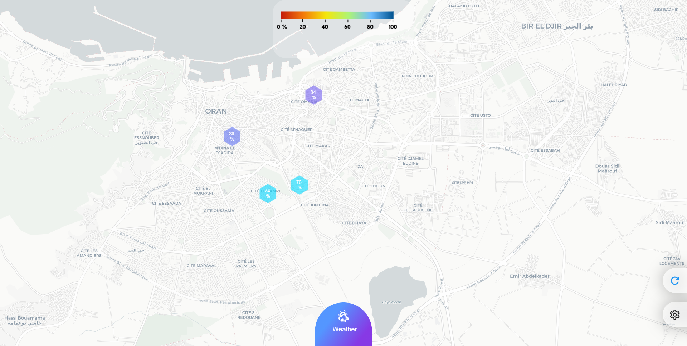

# University-Graduation-Project-Air-Quality-System

A contributed air quality system deployed in algeria, inspired from other ready to use solutions.
- https://cityair.io/
- https://kiel.maps.sensor.community/

# Showcase video

# User Applications
[Link to Web Application](https://pfe-air-quality.firebaseapp.com/)

[Link to Android Mobile Application](https://drive.google.com/file/d/1Tg73RzL-FEw4-oOlm1jPUTIAzaZBC5hw/view?usp=sharing) 

## Android Mobile Application Screenshot

| Home View| Home Menu | Home Guide | Home Drawer Menu |
|--|--|--|--|
|  |  |  | |

| Phone Auth | Device location | Sync data from mobile to Air Quality Device | 
|--|--|--|
|  |  |  |

| Weather Forecast  | Weather details |  
|--|--|
|  |  | 

## Android Mobile Application Screenshot

| Web Version  |
|--|
|  | 

# Contents
 - [How it works](#how-it-works)
   - [Device](#device)
   - [Backend](#backend)
   - [Frontend](#frontend)

# How It Works
- once device is configured in user environement, the device will send data periodically to backend
- backend will store data recieved from devices and provide a way to secure writing data into database using user authentication using SMS OTP
- frontend will display data stored in backend for mobile ( Android / IOS ) and Web 

## Device
we managed to create two devices one based on ESP8266 for low cost, and other based on ESP32 for maximum features
- [ESP32](https://github.com/salim97/University-Graduation-Project-Air-Quality-System/tree/master/ESP32%20Air%20Quality)
- [ESP8266](https://github.com/salim97/University-Graduation-Project-Air-Quality-System/tree/master/ESP8266%20Air%20Quality)

## Backend
we chosse firebase for [free plan offer](https://firebase.google.com/pricing), and since it's a serverless approach that mean it's durable and flexible
- [Firebase](https://github.com/salim97/University-Graduation-Project-Air-Quality-System/tree/master/Firebase)

## Frontend
we chosse flutter for cross platfrom user expirance mobile and web
- [Flutter App](https://github.com/salim97/University-Graduation-Project-Air-Quality-System/tree/master/Front-End%20Application/air_quality_system)

# Copyright © 2019-2021

[Benabadji Mohammed Salim](https://github.com/salim97)

[Amine Houari](https://github.com/AmineHouari98)

